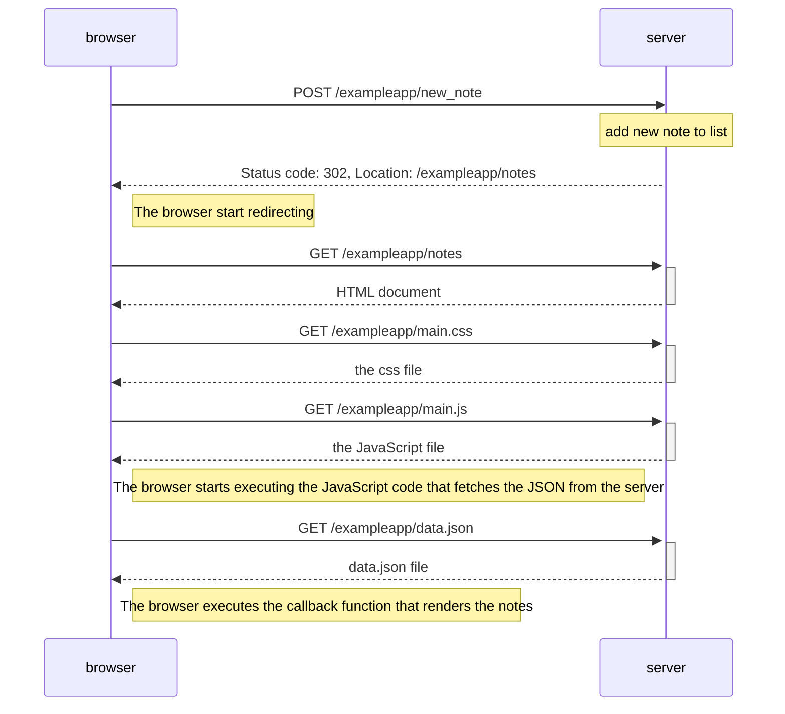

<!-- markdownlint-disable-file -->

new_note

```mermaid
sequenceDiagram
    participant browser
    participant server

    browser->>server: POST /exampleapp/new_note
    activate server
    Note over server: add new note to list
    server-->>browser: Status code: 302, Location: /exampleapp/notes
    Note right of browser: The browser start redirecting

    browser->>server: GET /exampleapp/notes
    activate server
    server-->>browser: HTML document
    deactivate server

    browser->>server: GET /exampleapp/main.css
    activate server
    server-->>browser: the css file
    deactivate server

    browser->>server: GET /exampleapp/main.js
    activate server
    server-->>browser: the JavaScript file
    deactivate server

    Note right of browser: The browser starts executing the JavaScript code that fetches the JSON from the server

    browser->>server: GET /exampleapp/data.json
    activate server
    server-->>browser: data.json file
    deactivate server

    Note right of browser: The browser executes the callback function that renders the notes

```
