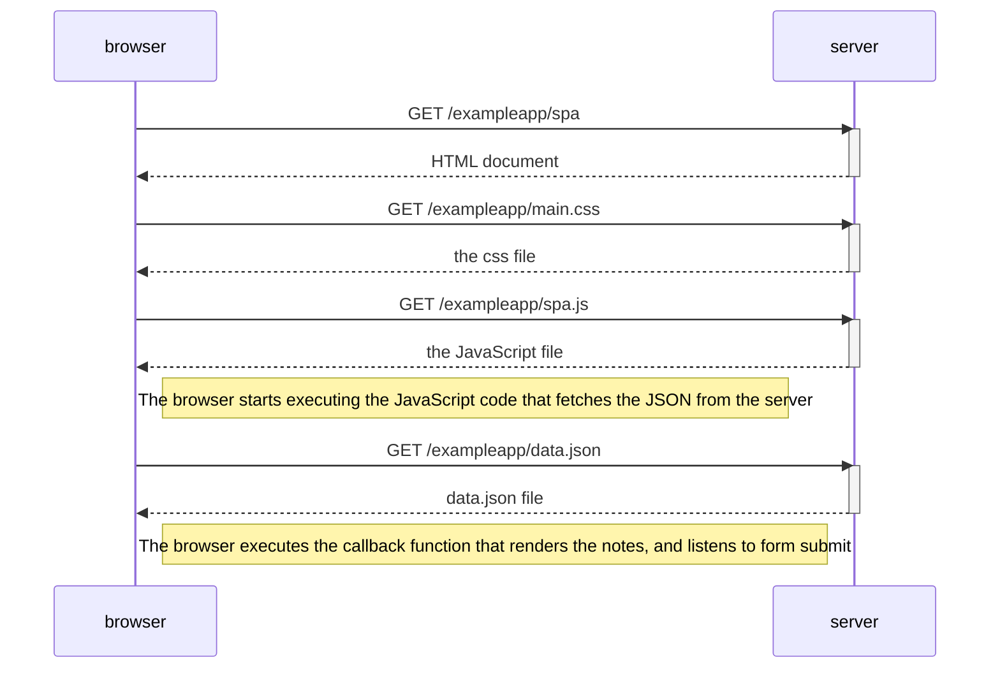

<!-- markdownlint-disable-file -->

```mermaid
sequenceDiagram
    participant browser
    participant server

    browser->>server: GET /exampleapp/spa
    activate server
    server-->>browser: HTML document
    deactivate server

    browser->>server: GET /exampleapp/main.css
    activate server
    server-->>browser: the css file
    deactivate server

    browser->>server: GET /exampleapp/spa.js
    activate server
    server-->>browser: the JavaScript file
    deactivate server

    Note right of browser: The browser starts executing the JavaScript code that fetches the JSON from the server

    browser->>server: GET /exampleapp/data.json
    activate server
    server-->>browser: data.json file
    deactivate server

    Note right of browser: The browser executes the callback function that renders the notes, and listens to form submit
```